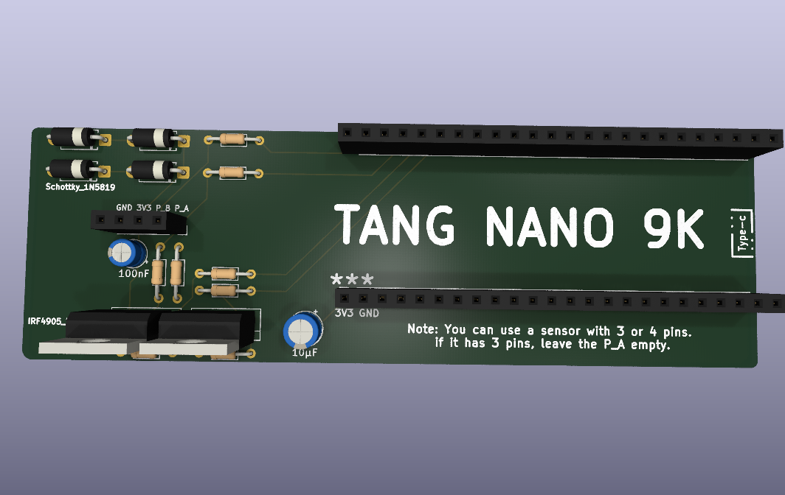

# FPGA Communication Checker

A tool for figuring out how an unknown chip talks before you know anything about it. The usual situation: you have a small component with 3 or 4 pins, no datasheet, and no idea which protocol it speaks or what each pin does. Instead of guessing, you hook it up to this board and look at what actually happens on the lines.

## Status

The FPGA side is still in progress.

Working today:
- Edge capture on two probe channels, timestamped and streamed to a Python host over UART.
- A framed UART protocol between the FPGA and the host (start/stop/reset/status commands, checksummed records).
- A from-scratch SPI master and UART tx/rx modules, built and tested on the Tang Nano 9K.
- A Python (Tkinter) viewer for the captured waveform, pulse-width stats, and CSV export.

Not built yet:
- Protocol decoders (UART, I2C, SPI framing on top of the raw edges).
- The identification logic that would actually tell you "this looks like I2C" from the capture.

## The PCB

A shield that sits on top of the Tang Nano 9K. It has two probe channels and a 4-pin socket for the device under test.

  
Each part on the probe lines is there for a specific reason:

- **220 ohm series resistor** on each probe line. The tool is meant to connect to devices whose voltage and drive strength are unknown, so the series resistor limits current if something unexpected is being driven.
- **Schottky clamp diodes (1N5819)** to 3.3V and GND on each probe line, so an over-voltage device can't reach the FPGA pin directly. Schottky specifically, not an ordinary diode: an ordinary diode clamps around 4.0V, which is already too high for this FPGA's inputs.
- **4.7k pull-ups switched by P-channel MOSFETs.** This is the part that needs explaining: to find out whether an unknown device already has its own pull-up, you need to disconnect ours first and see what the line does on its own. A fixed pull-up would make that measurement impossible, so it's switchable instead.
- **10k gate-to-source resistors** on those MOSFETs, so they stay off during the few milliseconds after power-up while the FPGA is still loading its bitstream and its pins are floating.

## Pin assignments

| Tang Nano 9K pin | Signal  | Notes |
|---|---|---|
| 54 | Ctrl_B | Active low. Pulling low turns on channel B's pull-up MOSFET. |
| 55 | Ctrl_A | Active low. Pulling low turns on channel A's pull-up MOSFET. |
| 56 | Pin_A  | Probe channel A. |
| 57 | Pin_B  | Probe channel B. |

Active low because these drive P-channel MOSFETs, which turn on when their gate is pulled low.

## Using it

Plug the unknown device into the 4-pin socket. A 4-pin device fills all four positions. A 3-pin device leaves Pin_A empty.

## Known limitations

- Only single-ended protocols are in scope. CAN and RS-485 are differential and need a transceiver, so they're not supported.
- A completely unpowered unknown chip can't be identified from the outside. This tool only works on devices that respond when probed.
- There are two probe channels, so SPI (which needs more lines) isn't reachable yet.
