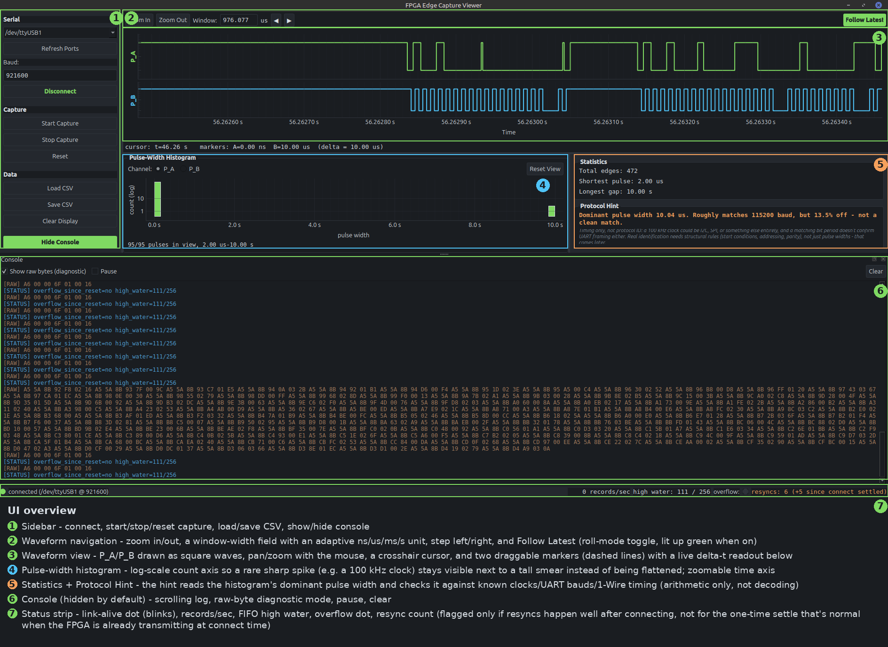
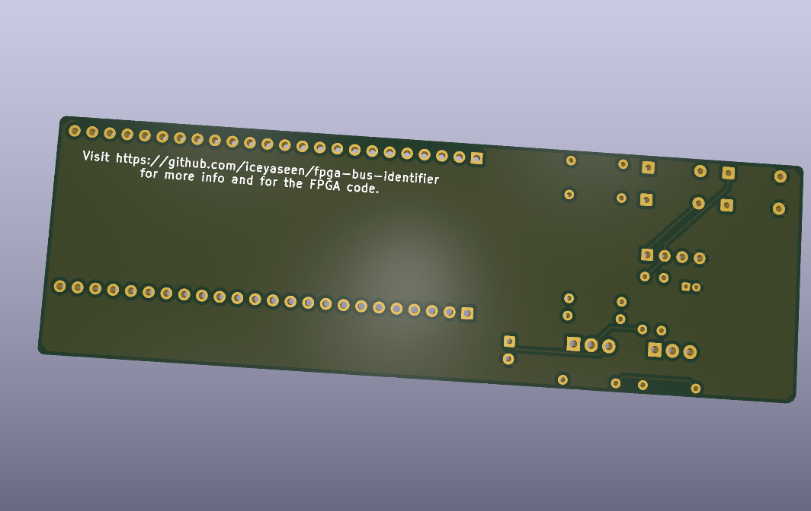
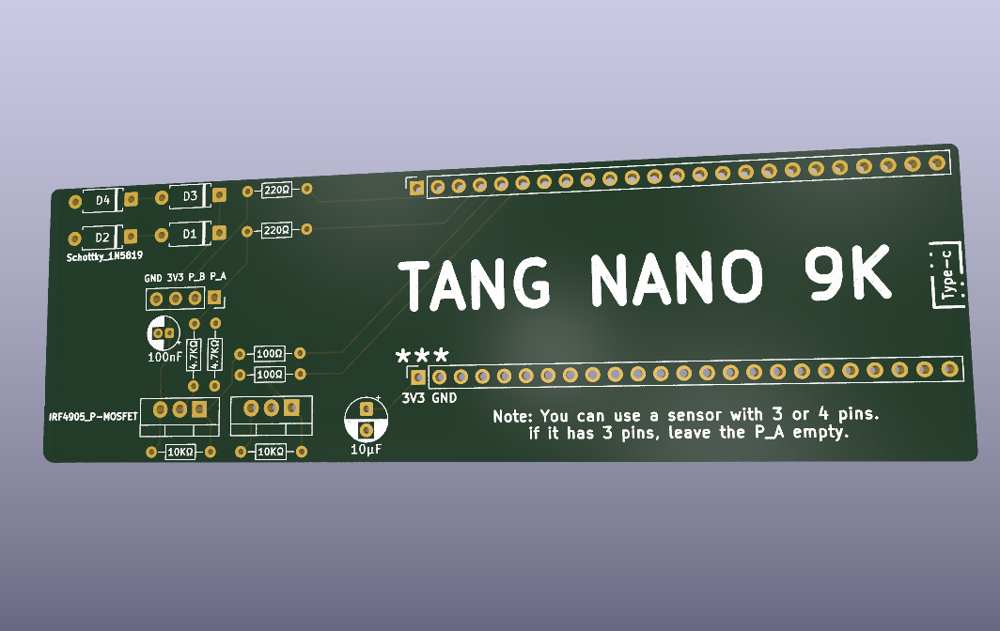

# FPGA Communication Checker

A tool for figuring out how an unknown chip talks before you know anything about it. The usual situation: you have a small component with 3 or 4 pins, no datasheet, and no idea which protocol it speaks or what each pin does. Instead of guessing, you hook it up to this board and look at what actually happens on the lines.

## Status

The FPGA side is still in progress.

Working today:
- Edge capture on two probe channels, timestamped and streamed to a Python host over UART at 921600 baud.
- A framed, checksummed, self-resynchronising UART protocol between the FPGA and the host (start/stop/reset/status commands, edge records, ACK/ERROR replies).
- A from-scratch UART tx/rx pair, built and tested on the Tang Nano 9K.
- A 256-entry, block-RAM-backed capture FIFO, with high-water mark reported in the status reply.
- A PySide6 + pyqtgraph host GUI (dark instrument theme): live or offline (loaded from CSV) waveform view with pan/zoom/cursor/two draggable markers, a log-scale/zoomable pulse-width histogram, CSV export, and a "protocol hint" panel that reads the dominant pulse width and reports the closest matching clock/UART baud/1-Wire pulse - timing arithmetic only, not protocol decoding.
- An active I2C master: bidirectional open-drain probe drivers, software-switchable pull-ups, an electrical pre-scan (own pull-up / needs ours / held low / floating, per channel, before any bus traffic), and a 0x08-0x77 address sweep that reports every address that ACKs. Driven from the host's "Scan I2C" button; verified in simulation against a fake I2C slave (exactly one address found, START/STOP/ACK timing checked against spec) and confirmed on real hardware against an MLX90614 at 0x5A.

Not built yet:
- Reading actual data back from a found device (the I2C master currently only does the one-byte address-probe transaction a scan needs) - UART/SPI as active protocols, and the identification logic that would tell you "this looks like I2C" purely from a passive capture (the hint panel is a timing-only nudge toward that, not the real thing).

## Host software

Requires Python 3 plus:
```
pip install PySide6 pyqtgraph pyserial
```
Then run:
```
python3 host/host.py [serial-port]
```
`host/protocol.py` holds the wire-format parser (framing, checksums, resync) and `host/hint.py` the protocol-hint arithmetic; both are plain Python with no GUI dependency, and each has a standalone test script (`host/test_frame_parser.py`, `host/test_hint.py`) that can be run without any hardware attached.

<p align="center">

<br>
<sup>Screenshot of a real capture: an ESP32 driving a 100 kHz I2C bus, probed on P_A/P_B. Numbered callouts below.</sup>
</p>

1. **Sidebar** - connect, start/stop/reset capture, load/save CSV, show/hide the console.
2. **Waveform navigation** - zoom in/out, a window-width field with an adaptive ns/us/ms/s unit, step left/right, and Follow Latest (an oscilloscope-style roll-mode toggle, lit up green when on).
3. **Waveform view** - P_A/P_B drawn as square waves. Pan/zoom with the mouse, a crosshair cursor that follows it, and two draggable markers (dashed lines) with a live delta-t readout below the plot.
4. **Pulse-width histogram** - log-scale count axis, so a rare sharp spike (e.g. a 100 kHz clock) stays visible next to a much taller structureless smear instead of being flattened to nothing; the time axis is independently zoomable to reveal fine structure.
5. **Statistics + Protocol Hint** - live edge/pulse/gap stats, plus a hint that reads the histogram's dominant pulse width and checks it against known clocks, standard UART bauds, and 1-Wire timing. Pure arithmetic, never a claim to have identified a protocol - see the disclaimer printed under it.
6. **Console** (hidden by default) - the scrolling log, a raw-byte diagnostic mode, pause (freezes the view without losing anything), and clear.
7. **Status strip** - a link-alive dot that blinks while connected, live records/sec, FIFO high-water mark, a sticky overflow-since-reset dot, and the frame resync count (flagged only if resyncs happen well after connecting, not for the one-time settle that's normal when the FPGA is already transmitting at connect time).

## The PCB

A shield that sits on top of the Tang Nano 9K. It has two probe channels and a 4-pin socket for the device under test.
<p align="center">
  

<br>
Each part on the probe lines is there for a specific reason:
</p>

- **220 ohm series resistor** on each probe line. The tool is meant to connect to devices whose voltage and drive strength are unknown, so the series resistor limits current if something unexpected is being driven.
- **Schottky clamp diodes (1N5819)** to 3.3V and GND on each probe line, so an over-voltage device can't reach the FPGA pin directly. Schottky specifically, not an ordinary diode: an ordinary diode clamps around 4.0V, which is already too high for this FPGA's inputs.
- **4.7k pull-ups switched by P-channel MOSFETs.** This is the part that needs explaining: to find out whether an unknown device already has its own pull-up, you need to disconnect ours first and see what the line does on its own. A fixed pull-up would make that measurement impossible, so it's switchable instead.
- **10k gate-to-source resistors** on those MOSFETs, so they stay off during the few milliseconds after power-up while the FPGA is still loading its bitstream and its pins are floating.

## Pin assignments

| Tang Nano 9K pin | Signal    | Notes |
|---|---|---|
| 54 | `ctrl_b`   | Active low. Pulling low turns on channel B's pull-up MOSFET. |
| 55 | `ctrl_a`   | Active low. Pulling low turns on channel A's pull-up MOSFET. |
| 56 | `probe_a`  | Probe channel A. |
| 57 | `probe_b`  | Probe channel B. |

Active low because these drive P-channel MOSFETs, which turn on when their gate is pulled low.

## Using it

Plug the unknown device into the 4-pin socket. A 4-pin device fills all four positions. A 3-pin device leaves `probe_a` empty.

## I2C scanning

Click **Scan I2C** in the host app. It runs two steps automatically:

1. **Electrical pre-scan** - before any bus traffic, each channel is classified purely by watching pull-up behaviour: *has its own pull-up* (reads high with ours off), *needs ours* (low/floating with ours off, clean high once ours switches on), *held low* (still low even with our pull-up on - a device driving it, or a short), or *floating* (unstable with no pull-up at all - nothing connected). This tells you whether the device is even I2C-shaped before wasting time on an address sweep.
2. **Address sweep** - START, address + write bit, check for ACK, STOP, for every address 0x08-0x77 (the valid 7-bit range). Every address that ACKs gets reported; an empty result is reported as "No devices found", not left ambiguous.

**Which probe is SDA and which is SCL is not auto-detected** - it's a host-side toggle ("SDA/SCL mapping: Normal (A=SDA, B=SCL) / Swapped (A=SCL, B=SDA)"), simpler and more transparent than guessing. If a scan against a known-good device finds nothing, flip the mapping and scan again. Verified against a real MLX90614 infrared thermometer (address 0x5A) on real hardware.

The scan's own generated I2C traffic is visible in the waveform view too (make sure capture is running - the "Scan I2C" button starts it automatically) - a good way to confirm the master is generating correct signals, not just trusting the reported result.

New host commands, single bytes like the existing ones (no framing needed on that side):

| Command | Effect |
|---|---|
| `A` / `a` | channel A pull-up on / off |
| `B` / `b` | channel B pull-up on / off |
| `N` / `W` | normal / swapped SDA-SCL pin mapping |
| `E` | run the electrical pre-scan |
| `I` | run the address sweep |

`E` and `I` are long-running, so unlike every other command their ACK is deferred until the operation actually finishes, not when the byte arrives - that's what lets the host safely chain pre-scan -> sweep off the pre-scan's own ACK. Two new frame types carry the results: `0xA9 PRESCAN_RESULT` (channel, category) and `0xAA ADDR_HIT` (one address that ACKed) - see `host/protocol.py` for the exact wire format, which follows the same `[MARKER][PAYLOAD][CHECKSUM]` scheme as everything else.

## Known limitations

- Only single-ended protocols are in scope. CAN and RS-485 are differential and need a transceiver, so they're not supported.
- A completely unpowered unknown chip can't be identified from the outside. This tool only works on devices that respond when probed.
- There are two probe channels, so SPI (which needs more lines) isn't reachable yet.
